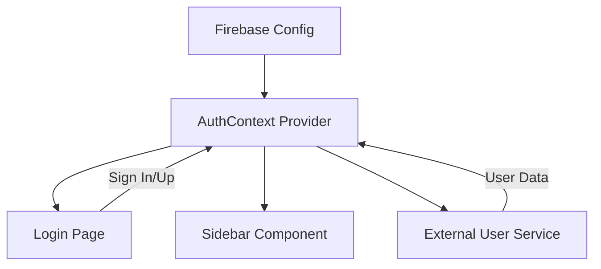

# Firebase Authentication System

This document details the implementation of the Firebase Authentication system in the Flow App, including the configuration, context management, and user data integration.

## 📖 Overview

The authentication system is built using **Firebase Auth** and **Next.js Client Components**. it provides email/password and Google sign-in capabilities, along with automatic user data fetching from an external service.

---

## 🏗️ Architecture

The system consists of four main components interacting with each other:



---

## 🔧 Component Breakdown

### 1. Firebase Initialization
- **File**: `lib/firebase.ts`
- **Description**: Initializes the Firebase app and Auth instance using the provided project credentials.
- **Exports**: `app`, `auth`.

### 2. Authentication Context (`AuthContext`)
- **File**: `components/AuthContext.tsx`
- **Features**:
  - **State Management**: Tracks the `user` (Firebase User) and `userData` (from external service).
  - **Token Management**: Automatically retrieves the Firebase ID token when a user logs in.
  - **Service Integration**: Fetches additional user details from `https://template-node.dataclouder.dev/api/user/logged`.
  - **Global Hook**: Provides `useAuth()` to access authentication state anywhere in the app.

### 3. Login Page
- **File**: `app/login/page.tsx`
- **Features**:
  - **Dual Mode**: Toggle between Sign In and Sign Up.
  - **Social Auth**: One-click Google Sign-in.
  - **Modern UI**: Built with `framer-motion` for animations and glassmorphism styling.
  - **Redirects**: Automatically redirects to the home page (`/`) upon successful auth.

### 4. Layout & Sidebar Integration
- **Root Layout**: The entire application is wrapped in `<AuthProvider>` in `app/layout.tsx`.
- **Sidebar**:
  - Hides automatically when on the `/login` route.
  - Displays the authenticated user's email.
  - Provides a "Sign Out" button that clears the Firebase session and `userData` state.

---

## 🛠️ Usage in Code

To access the authentication state in any client component:

```tsx
import { useAuth } from '@/components/AuthContext';
import { UserData } from '@/lib/types';

const MyComponent = () => {
    const { user, userData, loading, logout } = useAuth();
    
    if (loading) return <p>Loading...</p>;
    if (!user) return <p>Please log in</p>;

    return (
        <div>
            <h1>Welcome, {userData?.personalData.firstname || user.email}</h1>
            <p>Your plan: {userData?.claims.plan.type}</p>
            <button onClick={logout}>Sign Out</button>
        </div>
    );
};
```

---

## 🔒 Security Notes
- **JWT Tokens**: The ID token is retrieved using `getIdToken(user)` and sent in the `Authorization: Bearer <token>` header to the external user service.
- **Client-Side Protection**: While the UI adapts to the auth state, sensitive APIs should always verify the Firebase token on the server side.
